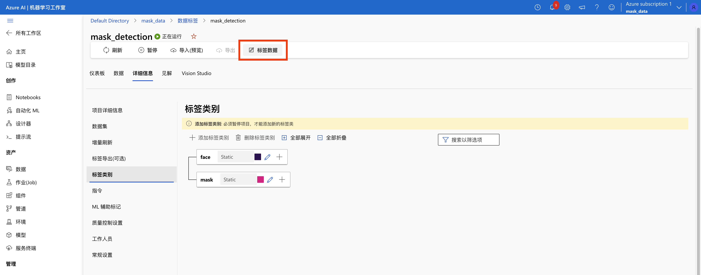
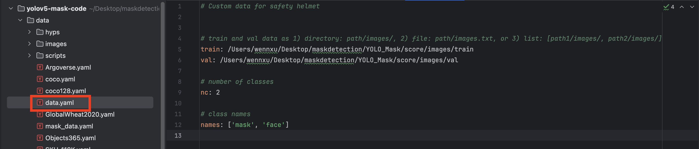

# 1. 计算机视觉

计算机视觉是人工智能的核心领域之一，其重点是创建解决方案，使 AI 的应用程序能够“看到”并理解世界。计算机没有像我们那样工作的生物眼睛，但它们能够处理图像；无论是来自实时摄像头原始数据，还是来自数字照片或视频。 这种图像处理能力是创建能够模仿人类视觉感知的软件的关键。

# 2. 适用于计算机视觉的机器学习

## 2.1 卷积神经网络 (CNN)

计算机视觉最常见的机器学习模型体系结构之一是卷积神经网络 (CNN)，这是一种深度学习体系结构。CNN 使用筛选器从图像中提取数值特征图，然后将特征值馈送到深度学习模型中以生成标签预测。在 CNN 的训练过程中，筛选器内核最初是使用随机生成的权重值定义的。 然后，随着训练过程的进行，根据已知标签值评估模型预测，并调整筛选器权重以提高准确性。 最终，经过训练的图像分类模型使用能够最好地提取有助于识别不同种类图像特征的筛选器权重。

## 2.2 卷积神经网络（CNN）的工作原理


1. 具有已知标签的图像（例如，0：苹果、1：香蕉或 2：橙子)将馈送到网络中以训练模型。
2. 当每个图像通过网络馈送时，使用一个或多个筛选器从图像中提取特征。 筛选器内核最初是随机分配的权重，并生成称为特征图的数值数组。
3. 特征图平展为特征值的一维数组。
4. 特征值馈送到完全连接的神经网络中。
5. 神经网络的输出层使用 softmax 或类似函数生成包含每个可能类的概率值的结果，例如 [0.2, 0.5, 0.3]。

在训练期间，将输出概率与实际类标签进行比较，例如，香蕉（类 1）的图像应具有值 [0.0, 1.0, 0.0]。 预测类分数与实际类分数之间的差异用于计算模型中的损失，并修改完全连接的神经网络中的权重和特征提取层中的筛选器内核，以减少损失。训练过程会重复多个时期，直到学习到一组最优的权重。 然后，保存权重，模型可用于预测标签未知的新图像的标签。

# 3. 使用Azure AI创建自定义图像分析模型进行口罩检测

## 3.1 创建新的自定义模型


## 3.2 准备训练图像

创建 Blob 容器将需要训练的图像上传到 Azure Blob 存储容器，并将它们全部放在容器的根目录中。


## 3.3 添加数据集


## 3.4 创建 Azure 机器学习标记项目

### 3.4.1 创建标签


### 3.4.2 手动标记训练数据




## 3.5 训练自定义模型


## 3.6 在 Vision Studio 中测试自定义模型


# 4. 基于YOLOv5的口罩检测

## 4.1 配置环境

首先创建python3.8的虚拟环境，在命令行中执行下列操作：

```bash
conda create -n py26 python==3.8.11
```

安装pytorch

```bash
pip3 install torch torchvision torchaudio
```

另外还需要安装程序所需的其他包，包括opencv，matplotlib这些包，不过这些包的安装比较简单，直接通过pip指令执行即可，我们cd到yolov5代码的目录下，直接执行下列指令即可完成包的安装。

```bash
pip3 install -r requirements.txt
```

### 使用预训练模型测试环境是否正常运行

在yolov5目录下执行下列代码

```bash
python detect.py --source data/images/bus.jpg --weights pretrained/yolov5s.pt
```

执行完毕之后将会输出下列信息


在runs目录下可以找到检测之后的结果


## 4.2 数据处理

使用labelimg进行数据标注，通过pip指令即可安装

```bash
pip3 install labelimg
```

在命令行中直接执行labelimg，即可启动数据标注软件。


### 4.2.1数据标注

1.打开图片目录，设置标注文件保存的目录


2.开始标注，画框，标记目标的label


标注完成之后会得到一系列的txt文件，这里的txt文件就是目标检测的标注文件，其中txt文件和图片文件的名称是一一对应的，打开具体的标注文件，文件中每一行表示一个目标，以空格进行区分，分别表示目标的类别id，归一化处理之后的中心点x坐标、y坐标、目标框的w和h。


### 4.2.2.修改数据集配置文件



## 4.3 模型训练

执行下列代码运行程序即可：

```bash
python train.py --data mask_data.yaml --cfg mask_yolov5s.yaml --weights pretrained/yolov5s.pt --epoch 100 --batch-size 4
```

等待模型训练结束，在`runs/train/exp`的目录下可以找到训练得到的模型和日志文件


## 4.4 模型使用

执行以下命令便可以得到一张检测结果

```bash
python detect.py --weights runs/train/exp/weights/best.pt --source data/images/fishman.jpg
```


# 5. Azure AI与YOLOv5在目标检测上的对比

## 5.1 算法和技术基础

1. Azure AI是微软 Azure 云服务中的一个图像识别工具集，它融合了多种先进的技术和算法。具体的技术细节可能因不同的功能模块而异，但通常也基于深度学习和神经网络技术。它提供了丰富的功能，如物体识别、文本识别、动作识别等，具有较高的准确性和广泛的应用场景。 

2. YOLOv5是一种基于深度学习的单阶段目标检测算法，属于卷积神经网络范畴。它将目标检测视为回归问题，直接从图像中预测目标的类别和位置。其网络结构包括主干网络（如 CSPDarknet53）用于提取图像特征、特征金字塔网络（FPN）用于融合不同尺度的特征，以及预测层生成最终检测结果。该算法在速度和性能上表现出色，适合实时目标检测任务。    


## 5.2 性能表现

1.  速度
   - Azure AI 的 Vision Studio在云端运行，其速度受到网络带宽和服务器负载等因素的影响。在网络状况良好的情况下，其处理速度也较为可观，但对于一些对实时性要求极高的场景，可能不如本地部署的 YOLOv5 那么迅速。    
   - YOLOv5以速度快著称，经过优化后可以在各种硬件平台上实现快速的推理速度，能够满足实时性要求较高的应用场景，例如视频监控、自动驾驶等。在一些硬件配置较好的设备上，甚至可以达到每秒处理上百帧图像。
2. 准确性：      
   - Vision Studio凭借微软的技术实力和大量的数据训练，在各种图像识别任务上具有较高的准确性和稳定性。对于复杂场景、多目标以及不同光照条件下的图像，都能有较好的识别效果。同时，它不断进行更新和优化，以提高识别的准确性。 
   - YOLOv5在多个公开数据集上取得了优异的性能，对于常见的目标检测任务具有较高的准确性。然而，它对于小目标、遮挡目标以及复杂场景的检测能力相对有限，可能会出现误检或漏检的情况。

## 5.3 易用性和灵活性  

1. Vision Studio提供了直观的用户界面和简单的操作流程，用户无需深入了解底层的技术细节，只需通过上传图像或视频、选择相应的功能模块，即可快速获得图像识别结果。同时，它支持与其他 Azure 服务的集成，方便用户构建更复杂的应用程序，但在定制化方面可能相对受限。

2. YOLOv5需要用户具备一定的深度学习和编程基础，以便进行模型的训练、部署和调优。用户需要下载代码、配置环境、准备数据集等，操作相对较为复杂。但是，它具有很高的灵活性，用户可以根据自己的需求对模型进行修改和优化，例如调整网络结构、更改超参数等。


## 5.4 应用场景和适用范围 

1. Vision Studio适用于多种应用场景，包括内容审核（检测文本、视频和图像中的不当内容）、人脸分析（检测人脸并分析其年龄、性别、情绪等）、图像分类、视频分析等。它特别适合企业级应用，能够满足大规模数据处理和复杂业务逻辑的需求。
2. YOLOv5广泛应用于各种实时目标检测场景，如视频监控系统中对人员、车辆等目标的检测；自动驾驶领域中对道路上的行人、车辆、交通标志等的识别；工业自动化中对生产线上的产品缺陷、异常情况的检测等。

## 5.5 成本  

1. Vision Studio采用云服务的收费模式，根据用户使用的功能和处理的数据量支付费用。对于小型项目或短期使用，成本可能相对较低，但对于长期、大规模的应用，费用可能会较高。
2. YOLOv5如果在本地部署，用户需要购买硬件设备（如 GPU）来支持模型的训练和推理，成本较高。但一旦部署完成，对于大规模的图像识别任务，后续的使用成本相对较低。
